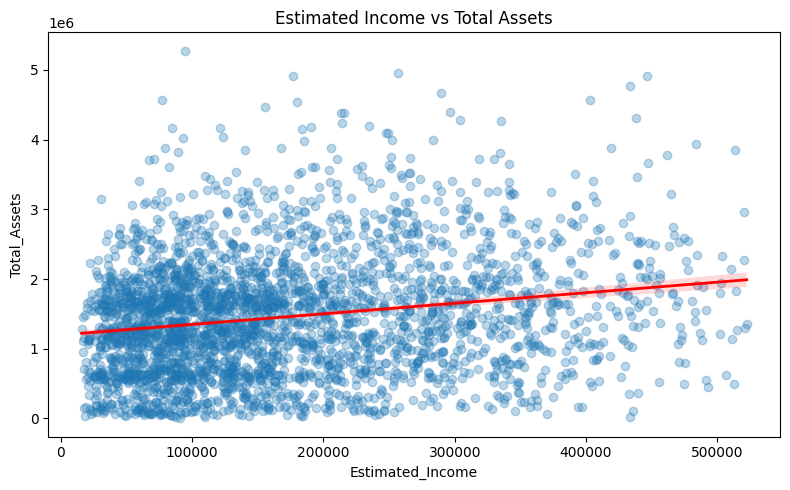

# 🏦 Banking Client Behaviour Analysis
### End-to-End Data Analyst Portfolio Project


---

## 📌 Project Overview

A complete end-to-end data analysis project on a **retail banking dataset of 3,000 clients**,
progressing through four structured phases:

> **EDA → Feature Engineering → Hypothesis Testing → Power BI Dashboard**

The goal was to understand customer wealth behaviour, identify risk profiles,
and surface actionable commercial opportunities — the kind of analysis a data
analyst would deliver to a banking product or strategy team.

---

## 🎯 Business Questions Answered

| # | Question | Method | Finding |
|---|----------|--------|---------|
| 1 | Do wealthier customers maintain more assets? | Spearman | ✅ Yes, but weakly (ρ = +0.191) |
| 2 | Do high-income customers have greater net worth? | Spearman | ⚠️ No — negative relationship (ρ = −0.191) |
| 3 | Does debt burden increase financial risk? | Spearman | ✅ Yes, significantly (ρ = −0.175) |
| 4 | Do longer-tenured customers hold more assets? | Spearman | ❌ No relationship (p = 0.754) |
| 5 | Do customers with more products have higher net worth? | Spearman | ✅ Yes (ρ = +0.131) |
| 6 | Does loyalty tier track asset value? | Kruskal-Wallis | ❌ No significant difference (p = 0.263) |
| 7 | Are certain age groups financially riskier? | Kruskal-Wallis | ❌ No (p = 0.892) |

---

## 📁 Repository Structure

```
banking-client-analysis/
│
├── 📂 data/
│   └── Banking_cleaned_for_EDA.xlsx        # Cleaned source dataset
│
├── 📂 notebooks/
│   ├── 01_EDA_Banking.ipynb                # Exploratory Data Analysis
│   └── 02_banking_hypothesis_testing.ipynb # Hypothesis Testing (7 tests)
│
├── 📂 reports/
│   ├── Banking_Portfolio_Report.docx       # Full project report (Word)
│   └── Results_hypothesis_testing/         # Saved hypothesis test charts
│       ├── 01_Estimated_Income_vs_Total_Assets.png
│       ├── 02_Estimated_Income_vs_Net_Worth.png
│       ├── 03_risk_weighting_boxplot.png
│       ├── 04_tenure_vs_assets.png
│       ├── 05_account_diversity_vs_networth.png
│       ├── 06_loyalty_vs_total_assets.png
│       └── 07_age_group_vs_risk.png
│
├── 📂 dashboard/
│   └── Banking_Dashboard.pbix              # Power BI dashboard (4 pages)
│
├── 📂 eda_outputs/                         # EDA chart exports
│   ├── 01_missing_values.png
│   ├── 02_dist_estimated_income.png
│   ├── 03_categorical_distributions.png
│   ├── 04_correlation_heatmap.png
│   └── 05_loyalty_breakdown.png
│
└── README.md
```

---

## 🔬 Phase Breakdown

### Phase 1 — Exploratory Data Analysis
**Notebook:** `01_EDA_Banking.ipynb`

- Loaded 3,000 clients × 25 columns from Excel
- Confirmed **zero missing values and zero duplicates**
- Computed summary statistics for 11 numeric features
- Identified **strong right skew** across all financial balance columns
  (mean income $171K vs median $142K)
- Produced distribution plots, box plots, and categorical breakdowns
- Built Spearman correlation heatmap (chosen over Pearson due to right skew)

**Key EDA findings:**
- Jade (lowest loyalty tier) accounts for **44.4%** of all clients
- European clients make up **43.6%** of the customer base
- **49.2%** of clients sit on a High fee structure
- All financial balance columns have significant right-skewed outliers
  (Bank Deposits up to $3.89M against a median of $463K)

---

### Phase 2 — Feature Engineering
**Notebook:** `01_EDA_Banking.ipynb` (second half)

Eight derived columns were created to enable richer analysis:

| Column | Formula | Purpose |
|--------|---------|---------|
| `Age_Group` | `pd.cut(Age, [17,30,45,60,85])` | Life-stage segmentation |
| `Tenure_Years` | `(Today − Joined_Bank) / 365.25` | Relationship length |
| `Join_Year` | `Joined_Bank.dt.year` | Cohort / trend analysis |
| `Total_Assets` | `Superannuation + Deposits + Saving + Checking` | Wealth proxy |
| `Total_Liabilities` | `Credit_Card_Balance + Bank_Loans` | Debt exposure |
| `Debt_to_Income` | `Total_Liabilities / Estimated_Income` | Credit risk signal |
| `Account_Diversity` | Count of non-zero product columns | Engagement depth |
| `Net_Worth` | `Total_Assets − Total_Liabilities` | Overall financial health |

---

### Phase 3 — Hypothesis Testing
**Notebook:** `02_banking_hypothesis_testing.ipynb`

All 7 hypotheses tested using **non-parametric methods** (Spearman correlation
and Kruskal-Wallis) after confirming non-normality via Shapiro-Wilk tests.

**Most important findings:**

> **H2 (Surprising):** Higher income is negatively correlated with net worth
> (ρ = −0.191, p < 0.001). High earners carry proportionally higher debt,
> compressing their actual net worth.

> **H4 (Myth-busting):** Customer tenure has **no relationship** with total assets
> (ρ = −0.006, p = 0.754). Longer banking relationships do not produce more
> financially engaged customers.

> **H5 (Actionable):** Account diversity positively predicts net worth
> (ρ = +0.131, p < 0.001). Cross-selling more products to low-diversity
> customers is both commercially viable and correlated with better financial outcomes.

---

### Phase 4 — Power BI Dashboard
**File:** `dashboard/Banking_Dashboard.pbix`

4-page interactive dashboard with cross-filtering slicers:

| Page | Focus |
|------|-------|
| **Home** | 6 KPI cards — total clients, loans, deposits, accounts |
| **Loan Analysis** | Loan breakdown by BR, occupation, income band, nationality |
| **Deposit Analysis** | Deposit breakdown mirroring loan structure |
| **Summary** | Full synthesis — loyalty, risk, trends, top clients |

---

## 💡 Top 3 Business Insights

**1. Income ≠ Wealth**
High-income customers carry proportionally higher liabilities.
The bank should segment by Net Worth, not income alone, and offer
debt consolidation and financial planning products to high-income,
low-net-worth clients.

**2. Tenure Does Not Drive Value**
Long-standing customers are not more financially engaged.
Loyalty programmes should reward product depth and deposit growth,
not years of membership.

**3. Account Diversity is the Best Cross-Sell Signal**
Customers holding more product types show higher net worth.
Targeting low-diversity, above-median-income clients with
Business Lending or Foreign Currency Accounts is the highest-value
cross-sell opportunity in this dataset.

---

## 🛠️ Tech Stack

| Tool | Version | Used For |
|------|---------|---------|
| Python | 3.12 | All analysis |
| pandas | 2.0 | Data manipulation |
| numpy | 1.26 | Numerical operations |
| matplotlib | 3.8 | Base plotting |
| seaborn | 0.13 | Statistical visualisation |
| scipy | 1.12 | Hypothesis testing |
| Power BI Desktop | Latest | Interactive dashboard |
| Jupyter Notebook | 7.0 | Development environment |

---

## ▶️ How to Run

```bash
# 1. Clone the repo
git clone https://github.com/YOUR_USERNAME/banking-client-analysis.git
cd banking-client-analysis

# 2. Install dependencies
pip install pandas numpy matplotlib seaborn scipy openpyxl jupyter

# 3. Launch Jupyter
jupyter notebook

# 4. Run notebooks in order
#    → notebooks/01_EDA_Banking.ipynb
#    → notebooks/02_banking_hypothesis_testing.ipynb
```

> **Power BI:** Open `dashboard/Banking_Dashboard.pbix` in Power BI Desktop.
> Update the data source path to point to `data/Banking_cleaned_for_EDA.xlsx`.

---

## 📊 Sample Visuals

<!-- Replace the paths below with your actual uploaded image URLs after pushing to GitHub -->

| Distribution Analysis | Hypothesis Testing Summary |
|----------------------|---------------------------|
|  |  |

---

## 📄 Project Report

The full written report is available in:
`reports/Banking_Portfolio_Report.docx`

It covers all four phases with tables, statistical interpretations,
business recommendations, and a Power BI dashboard review.

---

## 🙋 About

Built as a portfolio project to demonstrate end-to-end data analysis skills
including data cleaning, statistical testing, feature engineering,
and business storytelling through dashboards.

**Open to data analyst, business analyst, and analytics engineer roles.**

[](https://linkedin.com/in/YOUR_PROFILE)
[](https://github.com/YOUR_USERNAME)
